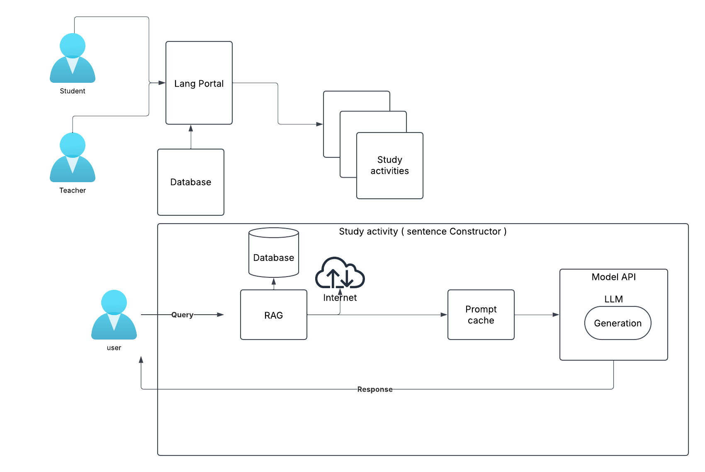

## Functional Requirements

The company wants to Manage GenAI to save the cost. And also to reduce all data privacy risks and concenrs.

Budget is ~ 10-15K.
Target students are ~ 300 to 400
Where city is : Nagasaki

## Assumptions

Budget is not exceeded.
Single server hopefully will be able to serve traffic for 300-400 students.

## Data Strategy

As these are study materials from different contributers , we will need to purchase copyrightet materials. And need to store safely in Database..

## Considerations

We're considering using IBM Granite because of following features:
- its a truley open-source model with training data that is traceable so we can avoid any copyright issues
- we are able to know what is going on in the model.

https://huggingface.co/ibm-granite

## Diagram 
